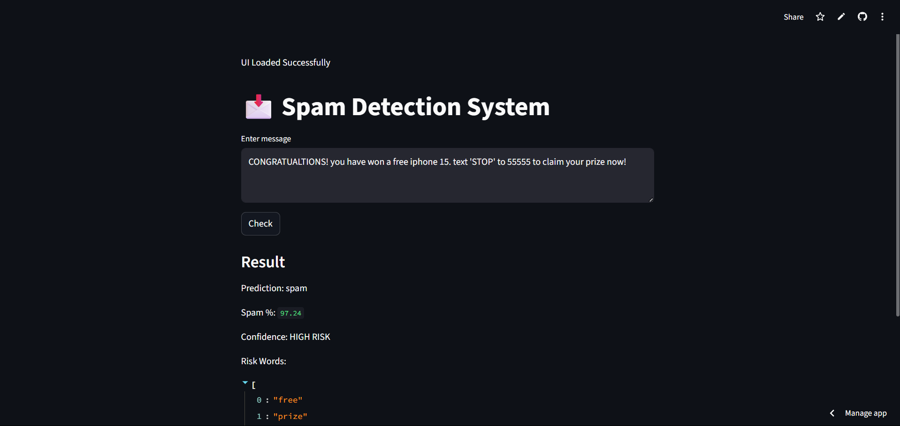

# 📩 Spam Detection ML System

## 🚀 Overview

This is an end-to-end Machine Learning project that classifies messages as **Spam** or **Ham (Not Spam)**.

It includes:

* ML model (TF-IDF + Logistic Regression)
* FastAPI backend (API for predictions)
* Streamlit frontend (interactive UI)

---

## 📸 Demo




## 🔴 Live Demo (Coming Soon)

This project will be deployed soon with a public link.

---

## 🧠 Features

* Real-time spam detection
* Probability-based confidence score
* Keyword-based risk analysis (Explainable AI)
* Batch prediction support
* Interactive UI

---

## 🏗️ Tech Stack

* Python
* Scikit-learn
* FastAPI
* Streamlit
* Joblib

---

## ⚙️ How It Works

1. Input text is cleaned (lowercase + punctuation removal)
2. Converted into numerical form using TF-IDF
3. Logistic Regression predicts spam/ham
4. API returns prediction + confidence + risk factors

---

## ▶️ Run Locally

### 1. Train Model

```
python train_model.py
```

### 2. Start Backend

```
uvicorn main:app --reload
```

### 3. Start Frontend

```
streamlit run ui.py
```

---

## 📊 Example Output

* Prediction: Spam
* Confidence: HIGH RISK
* Spam Probability: 92%
* Risk Factors: ["free", "win", "offer"]

---

## 🎯 Purpose

This project demonstrates:

* ML model building
* API development
* Frontend integration
* End-to-end deployment pipeline

---

## 📌 Future Improvements

* Deploy on cloud (Render / AWS)
* Use advanced NLP models (BERT)
* Add authentication system
* Improve dataset quality
